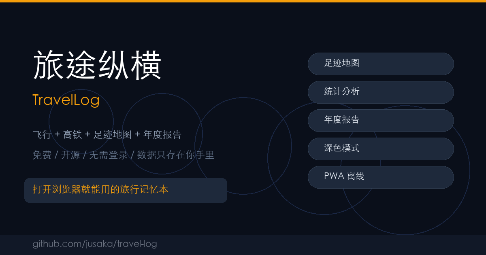

# ✈️ 旅途纵横 TravelLog

**打开浏览器就能用的旅行记忆本 — 飞行高铁一起记，数据只存在你手里。**

[](https://jusaka.github.io/travel-log/)
[](LICENSE)
[](https://jusaka.github.io/travel-log/)
[](#)
[](#)

> 🔒 **完全隐私**：无需登录、无需身份证、无需服务器。你的旅行数据只存在你的浏览器里。
>
> 🚄 **飞行+高铁**：市面上唯一原生支持飞行和高铁双模式的轻量旅行记录工具。



---

## ✨ 功能亮点

| 功能 | 描述 |
|------|------|
| 🗺️ **足迹地图** | Canvas渲染中国地图，金色飞行弧线+绿色高铁虚线，支持缩放拖拽 |
| 🎫 **登机牌风格** | 行程卡片仿真实登机牌设计，航班号自动识别航司 |
| 📊 **统计分析** | 总里程、飞行/高铁占比、趣味对比（绕地球/到月球/马拉松） |
| 📅 **年度报告** | GitHub风格热力图、年度之最、成就徽章系统 |
| 🌙 **深色/浅色** | 精心调色的双主题，深色地图金色航线尤其惊艳 |
| 🤖 **AI识别** | 粘贴行程文本，AI帮你自动填写表单 |
| 💾 **数据自由** | JSON/CSV导出导入，数据完全可控 |
| 📱 **PWA离线** | 安装到主屏幕，无网也能用 |

## 🆚 为什么选旅途纵横？

| 对比 | 航旅纵横 | 飞常准 | Flighty | **旅途纵横** |
|------|---------|--------|---------|-------------|
| 注册门槛 | 身份证 | 手机号 | Apple ID | **零** |
| 高铁支持 | 近期才有 | ❌ | ❌ | **✅ 原生支持** |
| 数据所有权 | 存在服务器 | 存在服务器 | 存在服务器 | **100%本地** |
| 价格 | 免费+广告 | ¥128/半年 | $60/年 | **完全免费** |
| 离线可用 | ❌ | ❌ | 部分 | **✅ 完全离线** |
| 开源 | ❌ | ❌ | ❌ | **✅ MIT** |

## 🚀 快速开始

**直接使用（推荐）：** 👉 [https://jusaka.github.io/travel-log/](https://jusaka.github.io/travel-log/)

**本地运行：**
```bash
git clone https://github.com/jusaka/travel-log.git
cd travel-log
python3 -m http.server 8765
# 打开 http://localhost:8765
```

**部署到你自己的 GitHub Pages：**
1. Fork 本仓库
2. Settings → Pages → 选择 main 分支
3. 访问 `https://<你的用户名>.github.io/travel-log/`

## 📱 技术栈

- **架构**：多文件PWA，无构建工具，无框架依赖
- **前端**：原生 HTML/CSS/JS + Canvas 绘图
- **存储**：localStorage（纯本地）
- **地图**：GeoJSON + Canvas 渲染
- **离线**：Service Worker (network-first)
- **代码量**：~4400行（JS 4100+ / CSS 300+）

## 🗂️ 内置数据

- 🛩️ 70+ 国内主要机场（IATA码 + 精确坐标）
- 🚉 30+ 高铁车站
- 🏢 20+ 航空公司（航班号前缀自动识别）

## 📦 版本历史

- **v4.4** (2026-03-17): Bug修复（搜索空态、表单验证、地图按钮）+ OG Meta + SEO
- **v4.3** (2026-03-16): 浅色/深色主题 + 地图适配
- **v4.2** (2026-03-16): CSV导入导出 + 中文表头支持
- **v4.1** (2026-03-16): 旅行纪录 + 地图城市交互
- **v4.0** (2026-03-16): 行程详情页 + 返程快捷 + 高铁距离修正
- **v3.0** (2026-03-15): 初始发布

## 🤝 贡献

欢迎 Issue 和 PR！

- 🐛 发现 Bug？[提交 Issue](https://github.com/jusaka/travel-log/issues)
- 💡 有新想法？[发起 Discussion](https://github.com/jusaka/travel-log/discussions)
- 🔧 想贡献代码？Fork → 修改 → PR

## 📄 许可

[MIT License](LICENSE) — 自由使用、修改、分发。

---

**⭐ 如果觉得有用，给个 Star 支持一下！**

Made with ❤️ for travelers
